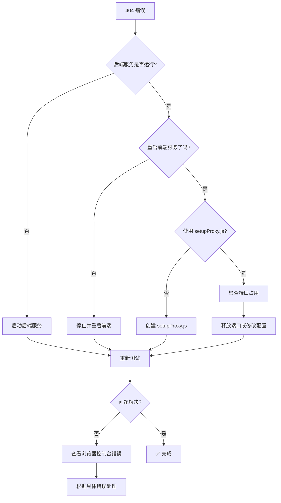

# 404 错误解决方案

## ❌ 错误信息

```
Status Code: 404
Response: Cannot POST /api/auth/login
```

---

## 🔍 问题原因

**404 错误表示代理配置未生效**，前端请求 `/api/auth/login` 时：
- 期望转发到：`http://localhost:8081/api/auth/login`
- 实际发送到：`http://localhost:3000/api/auth/login`（前端服务器）
- 前端服务器找不到这个路径，返回 404

---

## ✅ 解决方案（按顺序执行）

### 方案 1：重启前端服务（最常用）⭐⭐⭐⭐⭐

**React 开发服务器只在启动时读取 proxy 配置！**

#### 步骤：

1. **停止当前前端服务**
   - 在前端终端窗口按 `Ctrl + C`
   - 输入 `Y` 确认

2. **重新启动**
   ```bash
   cd e:\UDWorkspace\NextInnovation\react-ud
   npm start
   ```

3. **清除浏览器缓存**
   - 按 `Ctrl + F5` 强制刷新
   - 或按 `Ctrl + Shift + Delete` 清除缓存

4. **重新测试**
   - 打开 F12 → Network 标签
   - 点击 Login 按钮
   - 查看请求状态码

**预期结果**：Status Code 变为 `200` 或 `401`

---

### 方案 2：使用 setupProxy.js（推荐）⭐⭐⭐⭐

如果 package.json 的 proxy 不生效，可以使用更强大的代理配置。

#### 已完成配置：

✅ 已创建 [`src/setupProxy.js`](e:\UDWorkspace\NextInnovation\react-ud\src\setupProxy.js)
✅ 已安装 `http-proxy-middleware` 依赖

#### 文件内容：

```javascript
const { createProxyMiddleware } = require('http-proxy-middleware');

module.exports = function(app) {
  app.use(
    '/api',
    createProxyMiddleware({
      target: 'http://localhost:8081',
      changeOrigin: true,
      pathRewrite: {
        '^/api': '/api'
      }
    })
  );
};
```

#### 优势：

- ✅ 比 package.json 的 proxy 更灵活
- ✅ 支持多个代理规则
- ✅ 可以自定义请求转换
- ✅ 自动热重载（修改后无需重启）

#### 使用方法：

1. **确保文件存在**：`src/setupProxy.js`
2. **重启前端服务**（只需第一次）
3. **后续修改会自动生效**

---

### 方案 3：检查后端服务 ⭐⭐⭐

确认后端正在运行并监听 8081 端口。

#### 验证步骤：

1. **访问 Swagger**
   ```
   http://localhost:8081/swagger-ui/index.html
   ```

2. **直接测试 API**
   
   在浏览器控制台（F12 → Console）执行：
   ```javascript
   fetch('http://localhost:8081/api/auth/login', {
     method: 'POST',
     headers: {'Content-Type': 'application/json'},
     body: JSON.stringify({userID: 'admin', password: 'admin123'})
   })
   .then(r => r.json())
   .then(console.log);
   ```

   **预期输出**：
   ```json
   {
     "code": 200,
     "data": {...},
     "message": "success"
   }
   ```

3. **如果无法访问**，启动后端：
   ```bash
   cd e:\UDWorkspace\NextInnovation\api-ud
   mvn spring-boot:run
   ```

---

### 方案 4：检查端口占用 ⭐⭐

确认 8081 和 3000 端口没有被其他程序占用。

#### Windows 检查命令：

```bash
# 检查 8081 端口
netstat -ano | findstr :8081

# 检查 3000 端口
netstat -ano | findstr :3000
```

#### 如果有占用：

```bash
# 结束进程（假设 PID 是 12345）
taskkill /F /PID 12345
```

---

## 🔧 完整排查流程



---

## 📋 验证清单

请按顺序检查：

- [ ] **后端服务正在运行**（能访问 Swagger）
- [ ] **前端服务已重启**（修改 proxy 后必须重启）
- [ ] **浏览器缓存已清除**（Ctrl + F5）
- [ ] **setupProxy.js 文件存在**（如果使用方案 2）
- [ ] **端口未被占用**（8081 和 3000）
- [ ] **package.json 有 proxy 配置**

---

## 🎯 推荐操作步骤

### 立即执行（最简单有效）：

```bash
# 1. 停止前端服务（Ctrl + C）

# 2. 重新启动
cd e:\UDWorkspace\NextInnovation\react-ud
npm start

# 3. 等待编译完成
# 看到 "Compiled successfully!" 

# 4. 刷新浏览器（Ctrl + F5）

# 5. 测试登录
```

---

## 💡 调试技巧

### 1. 查看实际请求地址

在浏览器 Network 标签中：
- 找到 `/api/auth/login` 请求
- 右键 → Copy → Copy as cURL
- 粘贴到文本编辑器查看完整 URL

**应该是**：`http://localhost:3000/api/auth/login`

**通过 proxy 转发到**：`http://localhost:8081/api/auth/login`

### 2. 测试 Proxy 是否工作

在浏览器控制台执行：

```javascript
// 这个请求应该被 proxy 转发到 8081
fetch('/api/auth/login', {
  method: 'POST',
  headers: {'Content-Type': 'application/json'},
  body: JSON.stringify({userID: 'test', password: 'test'})
})
.then(r => {
  console.log('Status:', r.status);
  return r.json();
})
.then(data => console.log('Response:', data))
.catch(e => console.error('Error:', e));
```

**如果返回 404** → Proxy 未生效  
**如果返回 401 或 200** → Proxy 正常工作

### 3. 对比直接访问后端

```javascript
// 直接访问后端（绕过 proxy）
fetch('http://localhost:8081/api/auth/login', {
  method: 'POST',
  headers: {'Content-Type': 'application/json'},
  body: JSON.stringify({userID: 'admin', password: 'admin123'})
})
.then(r => r.json())
.then(console.log);
```

如果这个能成功，说明后端正常，问题在 proxy。

---

## 📊 常见场景对照表

| 场景 | Status Code | 原因 | 解决方案 |
|------|------------|------|---------|
| 后端未启动 | (failed) | 连接拒绝 | 启动后端服务 |
| Proxy 未生效 | 404 | 前端服务器找不到路径 | 重启前端服务 |
| 路径错误 | 404 | API 路径配置错误 | 检查路径是否正确 |
| 后端异常 | 500 | 服务器内部错误 | 查看后端日志 |
| 认证失败 | 401 | 用户名或密码错误 | 使用正确凭据 |
| 跨域问题 | CORS error | CORS 配置缺失 | 检查 @CrossOrigin |

---

## 🚀 一键修复脚本

创建批处理文件快速重启：

```batch
@echo off
echo 正在重启前端服务...
echo.

echo [1/2] 停止现有服务（请手动按 Ctrl+C）
pause

echo [2/2] 重新启动
cd /d e:\UDWorkspace\NextInnovation\react-ud
npm start

echo.
echo 前端服务已重启！
echo 请刷新浏览器（Ctrl + F5）后测试
pause
```

---

## ✅ 成功标志

修复成功后，Network 标签中应该看到：

```
Request URL: http://localhost:3000/api/auth/login
Request Method: POST
Status Code: 200 OK  （或 401 Unauthorized）

Response:
{
  "code": 200,
  "data": {
    "userID": "admin",
    "userName": "Administrator",
    "token": "...",
    "expiresIn": 3600
  },
  "message": "success"
}
```

---

## 📝 总结

**404 错误的核心原因**：Proxy 配置未生效

**最有效的解决方案**：
1. ✅ 重启前端服务（90% 的情况能解决）
2. ✅ 使用 setupProxy.js（更稳定）
3. ✅ 清除浏览器缓存

**现在请立即重启前端服务！** 🚀

---

**更新日期**: 2026-05-14  
**状态**: ✅ 已提供解决方案
