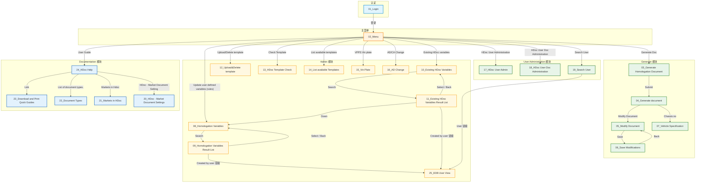

# 画面间跳转图

```mermaid
flowchart TD
    subgraph Auth["认证"]
        A1["01_Login"]
    end

    subgraph Menu["主菜单"]
        M["02_Menu"]
    end

    subgraph Generate["Generate 模块"]
        G1["03_Generate Homologation Document"]
        G2["04_Generate document"]
        G3["05_Modify Document"]
        G4["06_Save Modifications"]
        G5["07_Vehicle Specification"]
    end

    subgraph Admin["Admin 模块"]
        A2["08_Homologation Variables"]
        A3["09_Homologation Variables Result List"]
        A4["10_Existing HDoc Variables"]
        A5["11_Existing HDoc Variables Result List"]
        A6["12_Upload&amp;Delete template"]
        A7["13_HDoc Template Check"]
        A8["14_List available Templates"]
        A9["15_Vin Plate"]
        A10["16_AD Change"]
        A11["25_EDB User View"]
    end

    subgraph UserAdmin["User Administration 模块"]
        U1["17_HDoc User Admin"]
        U2["18_HDoc User Doc Administration"]
        U3["19_Search User"]
    end

    subgraph Doc["Documentation 模块"]
        D1["24_HDoc Help"]
        D2["23_Download and Print Quick Guides"]
        D3["22_Document Types"]
        D4["21_Markets in HDoc"]
        D5["20_HDoc - Market Document Settings"]
    end

    %% 认证 → Menu
    A1 -->|"登录"| M

    %% Menu → Generate
    M -->|"Generate Doc"| G1

    %% Generate Homologation Document 流程
    G1 -->|"Submit"| G2
    G2 -->|"Modify Document"| G3
    G2 -->|"Chassis no"| G5
    G3 -->|"Save"| G4
    G4 -->|"Back"| G3

    %% Menu → Admin
    M -->|"Update user defined variables (rules)"| A2
    A2 -->|"Search"| A3
    A3 -->|"Select / Back"| A2
    A3 -->|"Created by user 链接"| A11

    M -->|"Existing HDoc variables"| A4
    A4 -->|"Search"| A5
    A5 -->|"Select / Back"| A4
    A5 -->|"Down"| A2
    A5 -->|"Created by user 链接"| A11

    M -->|"Upload/Delete template"| A6
    M -->|"Check Template"| A7
    M -->|"List available templates"| A8
    M -->|"VPPS Vin plate"| A9
    M -->|"AD/CA Change"| A10

    %% Menu → User Administration
    M -->|"HDoc User Administration"| U1
    M -->|"HDoc User Doc Administration"| U2
    M -->|"Search User"| U3
    U3 -->|"User 链接"| A11

    %% Menu → Documentation
    M -->|"User Guide"| D1
    D1 -->|"Link"| D2
    D1 -->|"List of document types."| D3
    D1 -->|"Markets in Hdoc"| D4
    D1 -->|"HDoc - Market Document Setting"| D5

    %% 样式定义
    classDef auth fill:#e1f5fe,stroke:#0288d1,stroke-width:2px
    classDef menu fill:#fff3e0,stroke:#f57c00,stroke-width:2px
    classDef generate fill:#e8f5e9,stroke:#388e3c,stroke-width:2px
    classDef admin fill:#fff8e1,stroke:#f9a825,stroke-width:2px
    classDef userAdmin fill:#e8f5e9,stroke:#2e7d32,stroke-width:2px
    classDef doc fill:#e3f2fd,stroke:#1565c0,stroke-width:2px

    class A1 auth
    class M menu
    class G1,G2,G3,G4,G5 generate
    class A2,A3,A4,A5,A6,A7,A8,A9,A10,A11 admin
    class U1,U2,U3 userAdmin
    class D1,D2,D3,D4,D5 doc
```
